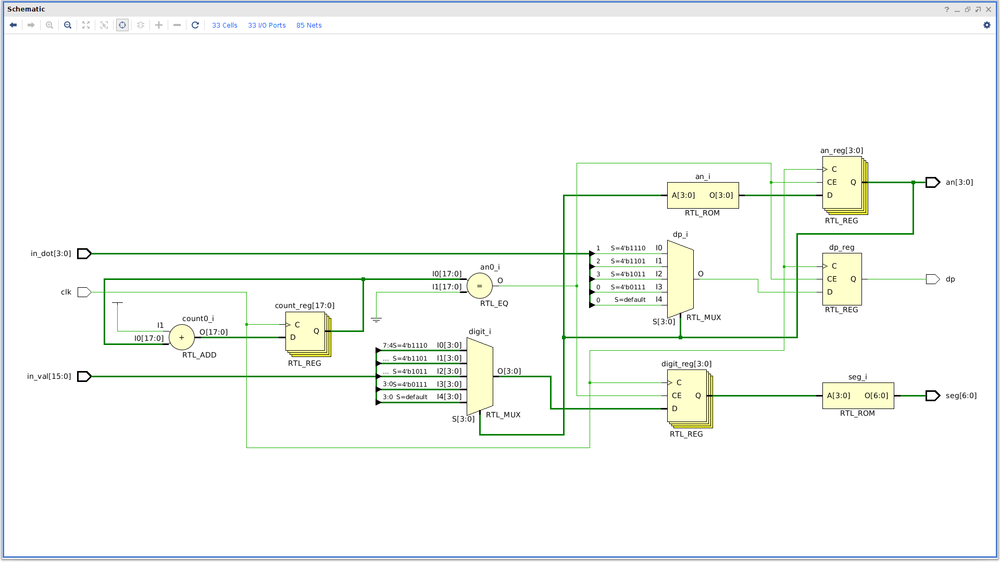

# Basys3HexaDisplay

A Verilog module, which can display four hexadecimal digits on the seven-segment display of the Basys 3 Artix-7 FPGA.

## Schematic

## Usage

Read the constraint file and add the missing properties, in your own constraint file(s).
To display hexadecimal digits on the seven-segment, you need only to instantiate the `display` module(with the right port connections) in one of your module and declare `seg`, `dp` and `an` as outputs (with the right width).

`in_val` is a 16-bit input which represents the four hexadecimal digits to display.

`clk` is the clock signal input.

`in_dot` is a 4-bit input which can be used to manage the four dots.

`seg` is a 7-bit output.

`dp` is a scalar output.

`reg` is a 4-bit output.
